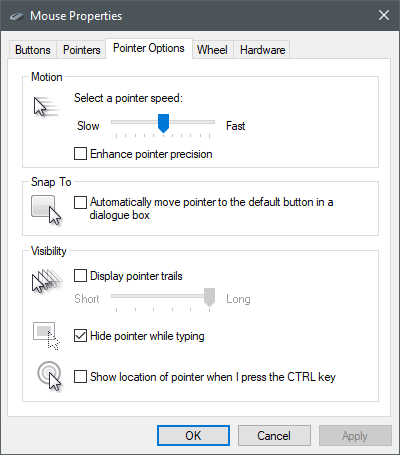
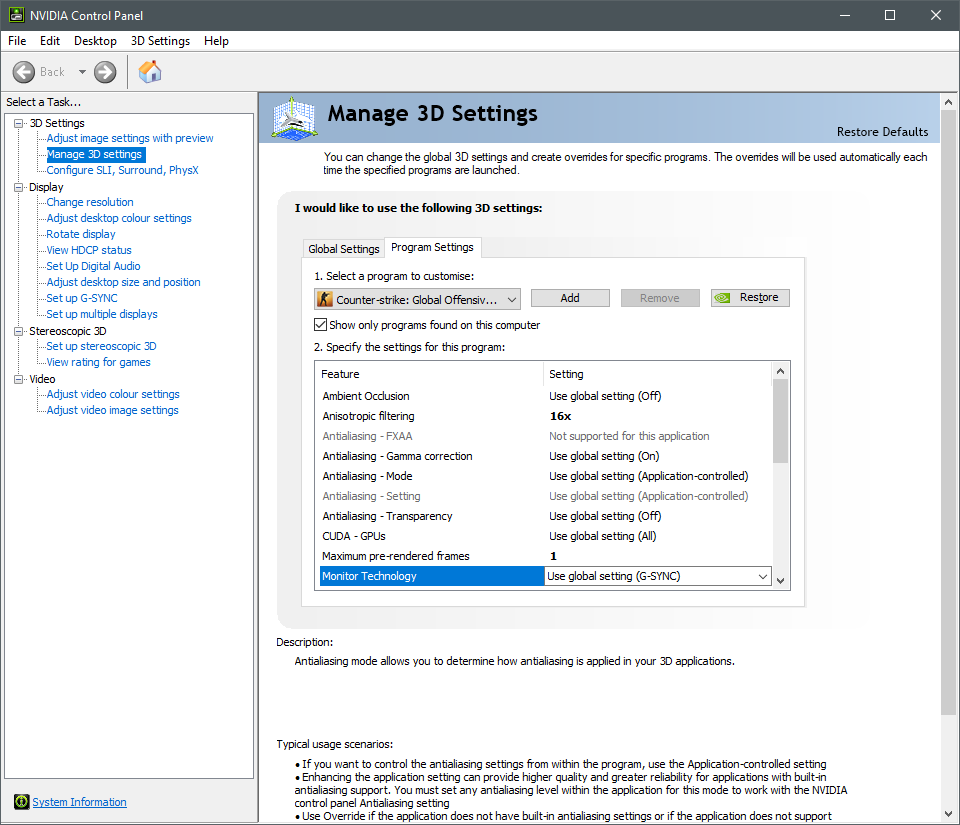
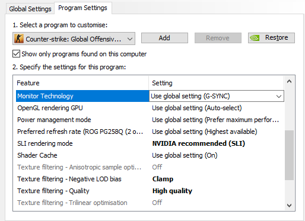
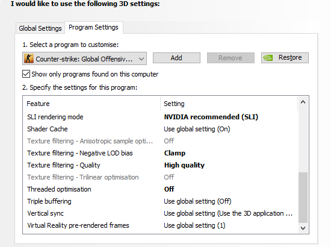
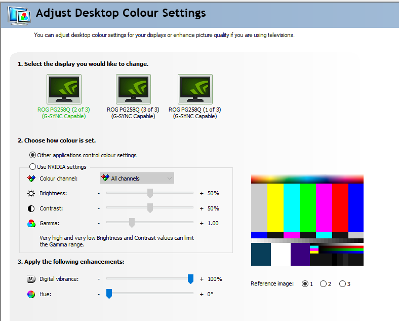
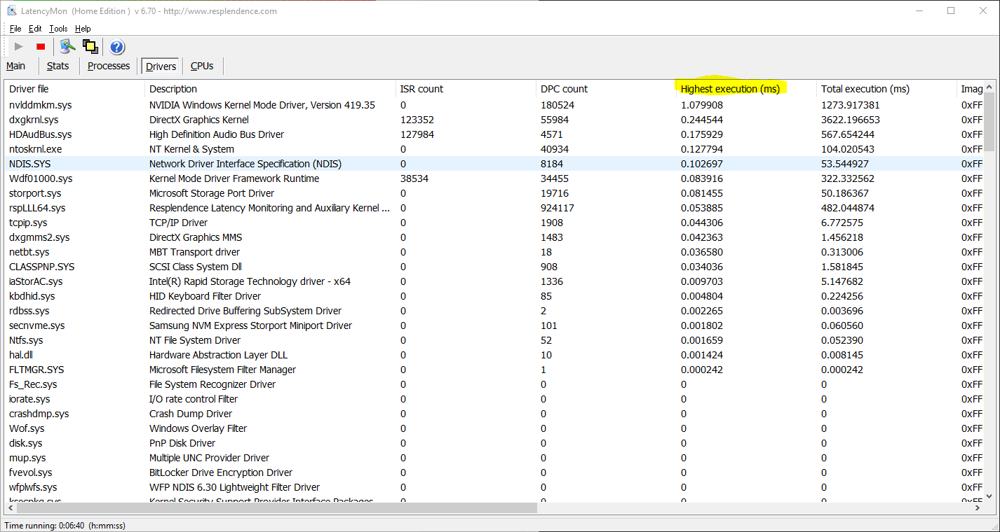

# Disable BIOS powersaving features:
TODO

# Windows stuff:  

## [Network Adapter Config](./network-adapter-config.md)  
----

## Enable Ultimate Performance Power plan:  
https://www.howtogeek.com/368781/how-to-enable-ultimate-performance-power-plan-in-windows-10/  
- Disables:  
  - CPU core parking  
  - Low power CPU clockspeeds  
  - A bunch of other stuff that isn't really required on gaming PCs  
  - Probably wouldn't do this on a laptop unless you like your lap catching fire.  

There's multiple ways of disabling this stuff on the internet but this is the easiest and least intrusive, without installing bloatware.  

----

## Mouse:
- You used to have to do a lot more tweaking but most games use raw input now so no need.  
- Just make sure Enhance Pointer Precision is off and the slider is in the middle:  
    

- Any settings other than this will induce negative or positive mouse acceleration in apps that don't use raw input.  

----

## Disable Xbox Game DVR:
https://www.howtogeek.com/273180/how-to-disable-windows-10s-game-dvr-and-game-bar/

- Causes all sorts of framerate issues due to recording a buffer, can really screw up borderless windowed games' input latency.  

----

## Nvidia drivers:
- These are the settings I use but a lot of this is personal preference to be honest.  
- Maximum pre-rendered frames is probably the most important one, reduces input latency.  
- Threaded Optimization does nothing since its a D3D11 (DirectX 11) only setting and CSGO is stuck in 2004 with D3D9 (DirectX 9.2c)  
- Ignore the SLI setting, I usually turn SLI off completely when playing CS, again to reduce input latency.  
    
    
    

Digital Vibrance:  
- This is a preference thing but you can crank up the color saturation using this:  
    
- You can use VibranceGUI to do this automatically when starting the game:  
  https://vibrancegui.com/
----

## Driver DPC Latency
- Have a read through this article:  
  https://support.focusrite.com/hc/en-gb/articles/208360865-Troubleshooting-DPC-latency  
- The context of that article is for audio playback & recording but high DPC latency can cause issues with games as well.  
- High DPC latency can cause stutters, fps drops, ping spikes, input lag and several other issues.  
- USB Wifi / 3G dongles, Webcams and USB soundcards have been the worst offenders in my experience.  
- I noticed irregular framerates, ping spikes and inconsistent input latency before solving DPC latency issues on my system.  
- Its fairly common for the Nvidia Windows Kernel Mode Driver to go above 1ms execution time when changing into fullscreen or changing resolutions so that can be ignored.  
- If any other drivers go above 1ms though they are probably causing problems.  
- A good test is to run latency mon, start monitoring, boot up a game of CS (do a deathmatch or something), then quit out and check the execution times:
    
----

# [CSGO Video Settings](./csgo-video-settings.md)  

----

# [CSGO Autoexec File](./csgo-autoexec.md)  

----