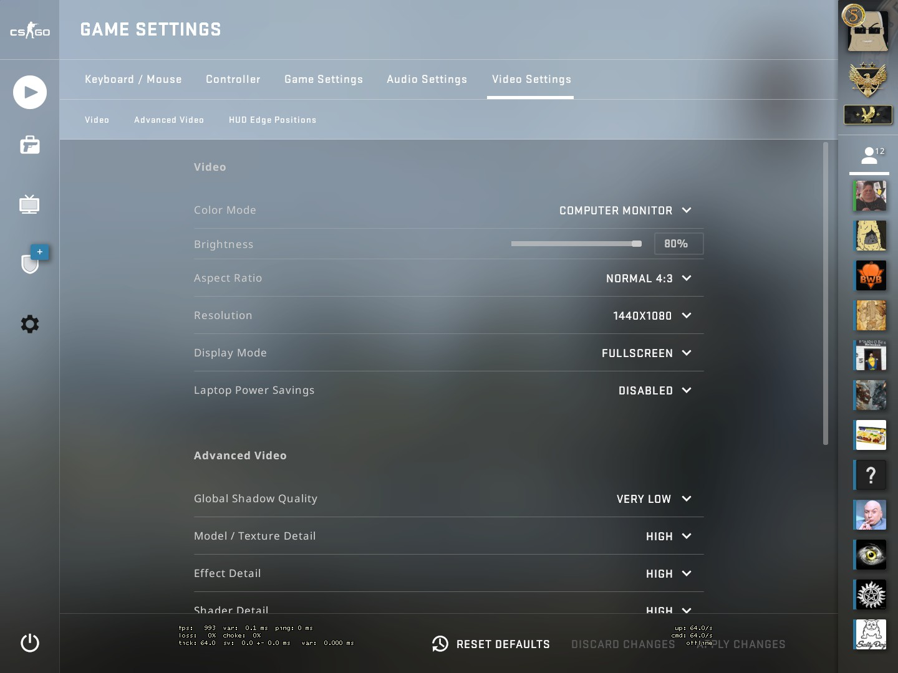
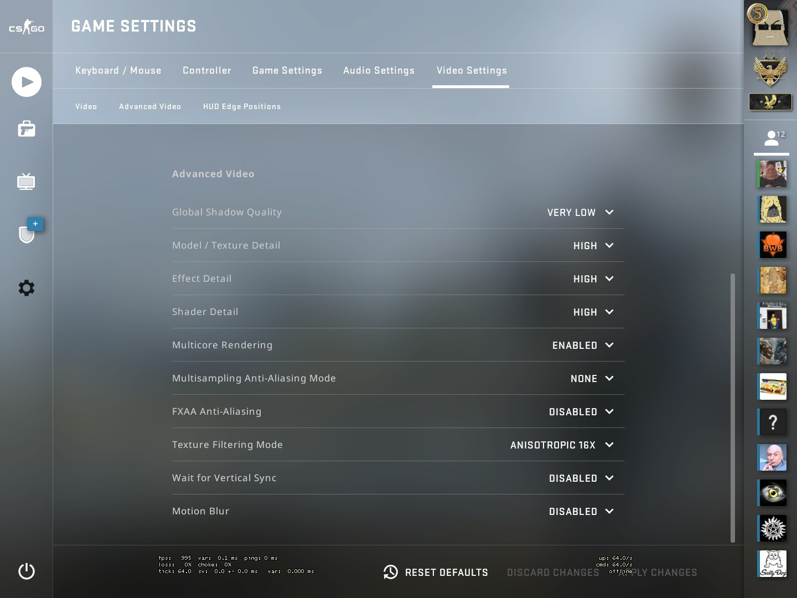

## Ingame video settings
- A lot of these are personal preference, here's what I use:  
    
    
- However setting Effect Detail and Shader Detail to High makes the smoke effect on molotovs easier to see through.  
- Global Shadow Quality and Model / Texture Detail are the most CPU intensive options (causes higher amounts of draw calls), and given that the game is primarily CPU limited its best to run these lower.  
- Multi core rendering should always be on.  
- Disable motion blur and FXAA unless you want to have a vaseline filter over the game.  
- As always disable V-sync.  
- MSAA can blur things very slightly but its more of a personal preference than anything.  