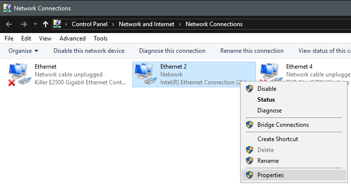
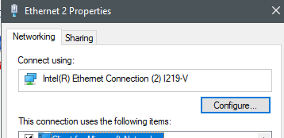
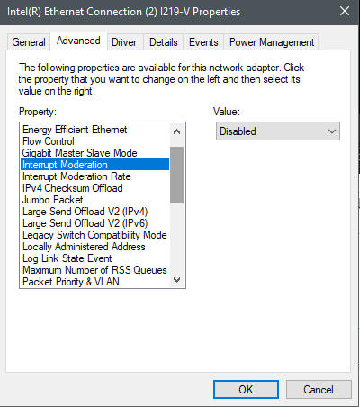
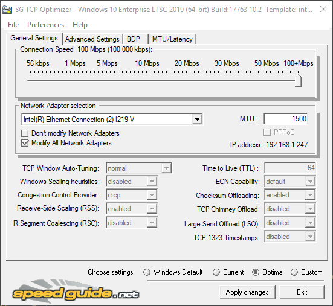
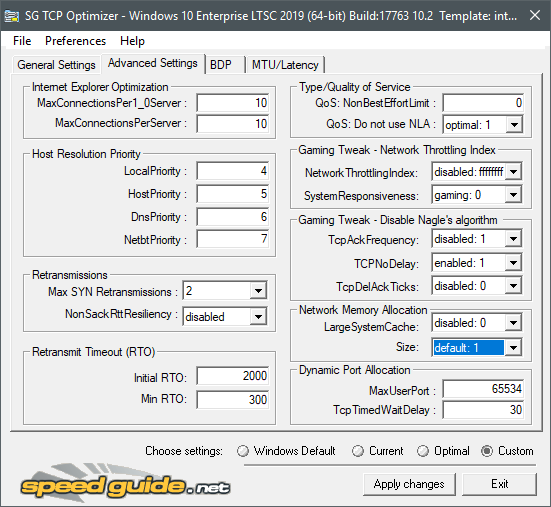

# Backup / take note of previous settings before doing any of this  
- Always avoid USB Wifi dongles / USB 3G dongles as their drivers usually have woeful DPC latency 
- High DPC Latency Causes:  
    - FPS drops  
    - Input Lag  
    - Stuttering  
    - Ping spikes  

----

## Configure network drivers to reduce latency  
- Open the advanced settings for the network adapter you use:  
    
- Click configure:  
    
- Open advanced tab:  
    

- Disable any "energy efficient" or "power saving" options  
- Disable Interrupt Moderation  
  - Reduces packet latency at the cost of CPU usage and slightly increased DPC latency.  
  - Should be worth it for games.  
- Make sure Jumbo packet is off (stop packet aggregation)  
- Disable Recieve Side Scaling  
  - Should reduce latency slightly  
  - At the cost of potentially total throughput by not using multithreading to spread the load  

Should probably leave everything else alone, I've seen some other guides on the internet that are more aggressive with these but could very negatively effect everyday performance for little gains in latency. For example I've seen it suggested that all offload settings should be turned off completely and that buffer sizes should be reduced but I never noticed any improvements by doing so, infact reducing the buffers made performance worse.  

----

## TCP Optimizer  
- Download: https://www.speedguide.net/downloads.php  
- Run as administrator set the following settings:  
    
- Click apply changes  
- Then click Custom, open advanced settings and set the 2 gaming tweak sections as follows:  
    
- Click apply changes  
- Reboot to get the changes (most of these settings are in the windows registry)  

You can use the MTU/Latency tab to determine the maximum MTU your router / modem / ISP can handle, but generally its 1500.  
You can delete TCP Optimizer after running it, it doesn't install a service or run on start up. Once the settings are entered you're done.

----